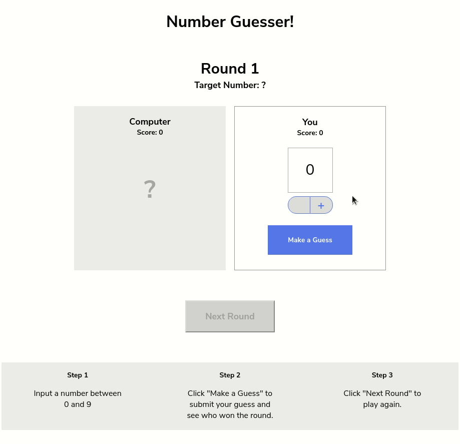

# JS Number Guesser

A basic number guessing Game created in html, with css and Javascript as part of codecademy practice challenge. Demonstrates basic knowledge of Javascript.

Here is what the final output looks like

